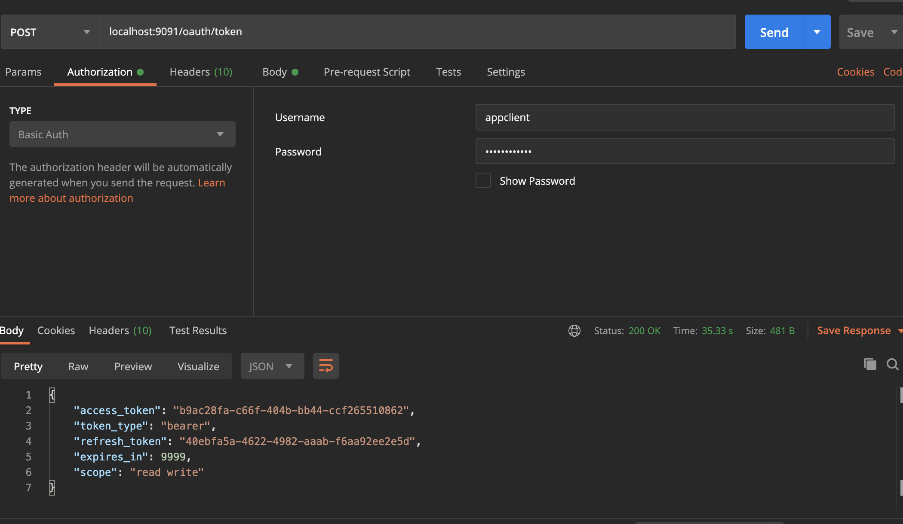

# OAuth2 Auth Server
Auth server needed to get and refresh key used to authenticate in backend

## Sample request

Use this token later in `Authorization` HTTP header like:
* `Authorization: Bearer <token>`

Implemented using https://codeaches.com/spring-cloud-security/oauth2-authorization-jdbc-token-store

https://www.techgeeknext.com/spring-boot-security/google-oauth2
